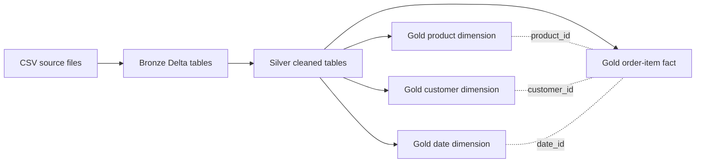

# Databricks E-Commerce Data Engineering & Analytics Project

Built a Databricks lakehouse pipeline that turns e-commerce CSV source files into curated Delta tables for order-item analysis. The project combines customer, product, brand, category, and calendar data with daily order-item files, applying a Bronze/Silver/Gold medallion flow. Implemented with Databricks notebooks, PySpark, Spark SQL, Unity Catalog, and Delta Lake, it prepares measures and dimensions for downstream business analysis.

## Project Overview

E-commerce order data arrives in multiple daily files and includes inconsistent values and formats, while useful sales analysis requires transactions to be connected to product, customer, and date context. This project was developed to practice and demonstrate practical data engineering and analytics skills by building a repeatable path from raw files to structured analytical tables.

The current implementation focuses on data ingestion, cleaning, enrichment, and modeling. It does not include a dashboard or completed aggregate KPI analysis; the Gold tables provide a foundation for those next steps.

## Project Objectives

- Organize source files and curated tables within an `ecommerce` Unity Catalog catalog.
- Implement Bronze, Silver, and Gold processing for the available e-commerce entities.
- Improve consistency of source data through type conversion, standardization, anomaly mapping, and duplicate handling.
- Build product, customer, and date dimensions and an order-item fact table.
- Add transaction-level sales measures, coupon indicators, and a USD-converted net amount to support analysis across products, customers, dates, and channels.

## Technologies & Skills

- Databricks notebooks and Unity Catalog
- PySpark DataFrames and built-in functions
- Spark SQL, temporary views, table creation, and joins
- Delta Lake tables
- Medallion architecture (Bronze, Silver, Gold)
- Dimensional modeling: dimensions and an order-item fact table
- CSV ingestion with explicit schemas for dimension inputs and inferred schema for order items
- Data cleaning, type casting, deduplication, null handling, and reference mapping
- Date key creation, derived measures, and currency conversion

## Data Architecture / Data Model

The notebooks create an `ecommerce` catalog with `bronze`, `silver`, and `gold` schemas. CSV files are ingested into Bronze Delta tables with source-file and ingestion metadata where implemented. Silver processing standardizes and cleans the records. Gold processing joins and shapes the dimensions, then enriches order-item rows with calculated sales fields.

The fact table is at **order-item grain**: each record represents an item line, carrying identifiers for the transaction, customer, product, and date along with channel, coupon, quantity, price, discount, tax, and calculated sales amounts. The Gold outputs are `ecommerce.gold.gld_dim_products` (product, category, and brand attributes), `ecommerce.gold.gld_dim_customers` (customer and mapped region attributes), `ecommerce.gold.gld_dim_date` (calendar attributes), and `ecommerce.gold.gld_fact_order_items` (transaction-line measures and identifiers).



The current product-dimension SQL includes `LIMIT 5`, so that Gold dimension is restricted to five rows until the limit is removed. The fact table is built from the Silver order-item table; its product, customer, and date identifiers are intended to connect to the corresponding dimensions.

## What I Implemented

- **Catalog setup:** Created the `ecommerce` catalog and its Bronze, Silver, and Gold schemas.
- **Bronze ingestion:** Read brand, category, product, customer, and calendar CSVs with declared schemas, and loaded the daily order-item CSV files using schema inference. Wrote the inputs as Delta tables and added file and ingestion metadata in the applicable notebooks.
- **Silver data preparation:** Trimmed and normalized codes and labels; corrected selected known category, country, and material values; converted weight, length, quantity, discount, price, tax, and date fields; replaced missing customer phone values; and removed duplicates using entity keys.
- **Gold dimensions:** Joined products to category and brand descriptions, mapped customer country/state combinations to regions, and derived calendar fields including a `date_id`, month, and weekend flag.
- **Gold order-item fact:** Calculated gross amount, discount amount, and net amount (gross less discount, with tax retained as a separate field). Added a date key and coupon flag, then applied a fixed currency-to-USD rate mapping to calculate a rounded USD net amount.

## Business Questions

The curated tables are structured to support queries such as:

- How do order-item sales and discounts vary over time, including by month, quarter, or weekend?
- Which products, brands, and categories contribute the most net sales?
- How do sales vary by customer country or mapped region?
- How do order-item sales compare across website and mobile channels?
- What is the relationship between coupon use, discounts, and net sales?
- How do quantities and transaction values differ across source currencies after USD conversion?

These are analysis questions enabled by the model; the repository does not currently contain aggregate query results answering them.

## Key Results / Insights

The notebooks include no saved execution outputs, and the repository contains no finished KPI queries or dashboard. As a result, there are no verified numerical findings to report here. The implemented Gold fact provides line-level quantity, gross amount, discount amount, net amount, tax, coupon, channel, and USD-converted net amount; paired with the dimensions, these fields are intended to support the time, product, geography, channel, and promotion analyses listed above.

## Repository Structure

```text
.
├── datasets/
│   ├── brands/                 # Brand source CSV
│   ├── category/               # Category source CSV
│   ├── customers/              # Customer source CSV
│   ├── date/                   # Calendar source CSV
│   ├── order_items/landing/    # Daily order-item CSV files
│   └── products/               # Product source CSV
├── scripts/
│   ├── 1_setup/                # Catalog and schema setup
│   ├── 2_medallion_processing_dim/  # Dimension Bronze, Silver, Gold
│   └── 3_medallion_processing_fact/ # Order-item fact Bronze, Silver, Gold
└── README.md
```

## How to Run

This project is implemented for Databricks and uses Unity Catalog Volumes. The notebooks read from `/Volumes/ecommerce/source_data/raw`; the local `datasets/` folder is not referenced directly by the notebook paths.

1. Use a Databricks workspace with Unity Catalog, notebook support for PySpark and Spark SQL, and permissions to create the catalog/schemas and read the required Volume.
2. Create the `ecommerce` catalog and the `source_data` schema, then create a Volume named `raw` in that schema. The setup notebook creates only the catalog and `bronze`, `silver`, and `gold` schemas; it does not create the source Volume.
3. Upload the repository datasets into the Volume while preserving the paths expected by the notebooks:

	```text
	/Volumes/ecommerce/source_data/raw/brands/brands.csv
	/Volumes/ecommerce/source_data/raw/category/category.csv
	/Volumes/ecommerce/source_data/raw/customers/...
	/Volumes/ecommerce/source_data/raw/date/...
	/Volumes/ecommerce/source_data/raw/products/...
	/Volumes/ecommerce/source_data/raw/order_items/landing/*.csv
	```

	The notebooks use `*.csv` for the customer, date, and product folders, and the order-item landing folder. Preserve the `order_items/landing` subfolder.
4. Run the notebooks in this order:
	- `scripts/1_setup/setup_catalog.ipynb`
	- `scripts/2_medallion_processing_dim/1_dim_bronze.ipynb`
	- `scripts/2_medallion_processing_dim/2_dim_silver.ipynb`
	- `scripts/2_medallion_processing_dim/3_dim_gold.ipynb`
	- `scripts/3_medallion_processing_fact/1_fact_bronze.ipynb`
	- `scripts/3_medallion_processing_fact/2_fact_silver.ipynb`
	- `scripts/3_medallion_processing_fact/3_fact_gold.ipynb`

The processing notebooks write tables in `ecommerce.bronze`, `ecommerce.silver`, and `ecommerce.gold`. Their writes use overwrite mode, so rerunning a stage replaces that stage's target tables rather than appending incrementally. The source paths are fixed in the notebooks and should be updated if the Volume location differs.

## SQL Concepts Demonstrated

- Creating a catalog and schemas with Spark SQL.
- Creating a Gold table from a SQL `SELECT` and joining temporary views with `LEFT JOIN`.
- Combining Spark SQL cells with PySpark DataFrame transformations.
- Grouping and counting rows to inspect duplicate category keys.
- Applying conditional expressions, casts, string functions, date functions, and derived columns.
- Joining reference mappings for product descriptions, customer regions, and currency rates.

The notebooks do not currently demonstrate SQL Server/T-SQL, window functions, CTE-based reporting, or persisted reporting views.

## What This Project Demonstrates

This project demonstrates the ability to structure a small lakehouse workflow, ingest file-based data, apply practical cleaning rules, model transaction and descriptive data separately, and derive measures for downstream analysis. It also shows hands-on use of PySpark and Spark SQL in Databricks. The current scope is a learning and portfolio project; production orchestration, automated validation, and business reporting are not implemented.

## Future Improvements

- Remove the five-row limit from the Gold product dimension and validate dimension-to-fact key coverage.
- Add repeatable data-quality checks for null keys, duplicate records, and unmapped values.
- Replace hard-coded currency rates with a maintained, date-effective rate table and handle currencies without a match.
- Add incremental processing and workflow orchestration instead of overwriting each target table.
- Build and execute aggregate analyses or a dashboard, then publish verified findings with their query logic.
